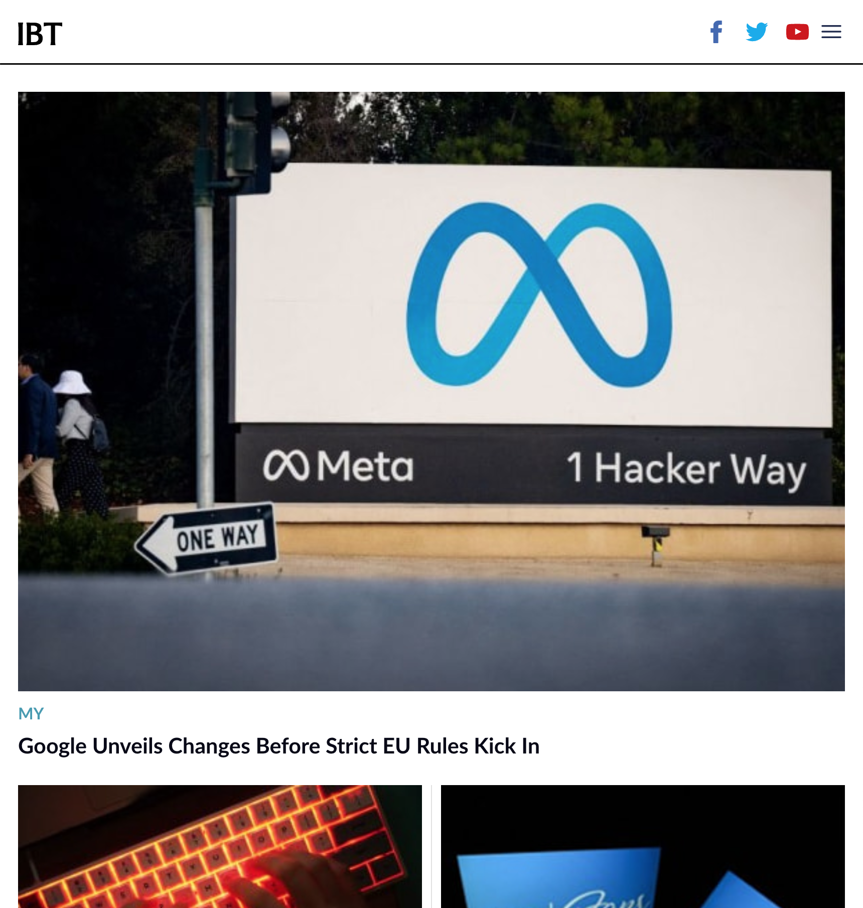
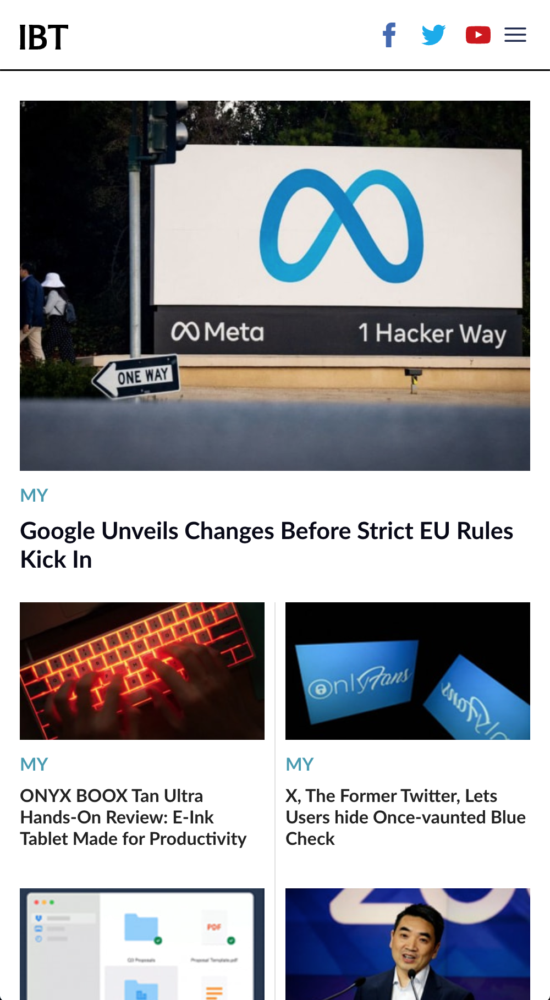
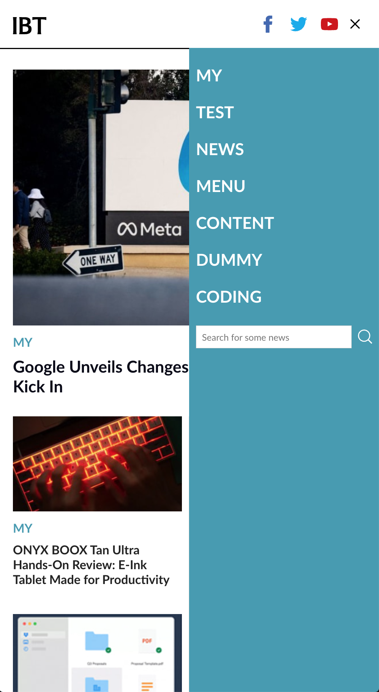

# IBT Responsive Website

Developed as a technical challenge by Ibai Fernandez, this responsive website features a modern and user-friendly design, making use of HTML, CSS, and JavaScript.

## Final Result

## Table of Contents

- [About the Project](#about-the-project)
- [Features](#features)
- [Usage](#usage)
- [Contact](#contact)
- [Additional Views](#additional-views)

## About the Project

The **IBT Responsive Website** is a project developed by Ibai Fernandez to showcase responsive web design skills. The website is built using HTML, CSS, and JavaScript to create a user-friendly and visually appealing experience across various devices.

## Features

- Responsive design that adapts to different screen sizes and devices.
- Navigation menu with options for easy navigation through the content.
- News section displaying featured news items and additional news articles.
- Social media integration for easy sharing and engagement.
- Footer with essential links and copyright information.

## Usage

Feel free to use this project to learn about responsive web design, HTML, CSS, and JavaScript. You can also use it as a template for your own projects.

## Contributing

Contributions are welcome! If you find any issues or improvements, please open an issue or submit a pull request.

## Contact

**Ibai Fernandez**: [Portfolio](https://portfolio.ibaifernandez.com) - [GitHub](https://github.com/ibaifernandez) - [LinkedIn](https://www.linkedin.com/in/ibaifernandez/)

**Project Link**: [https://github.com/ibaifernandez/ibt-technical-challenge](https://github.com/ibaifernandez/ibt-technical-challenge)

## Additional Views

### Additional View 1

***

### Additional View 2

***

### Additional View 3

***

### Additional View 4

***